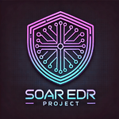
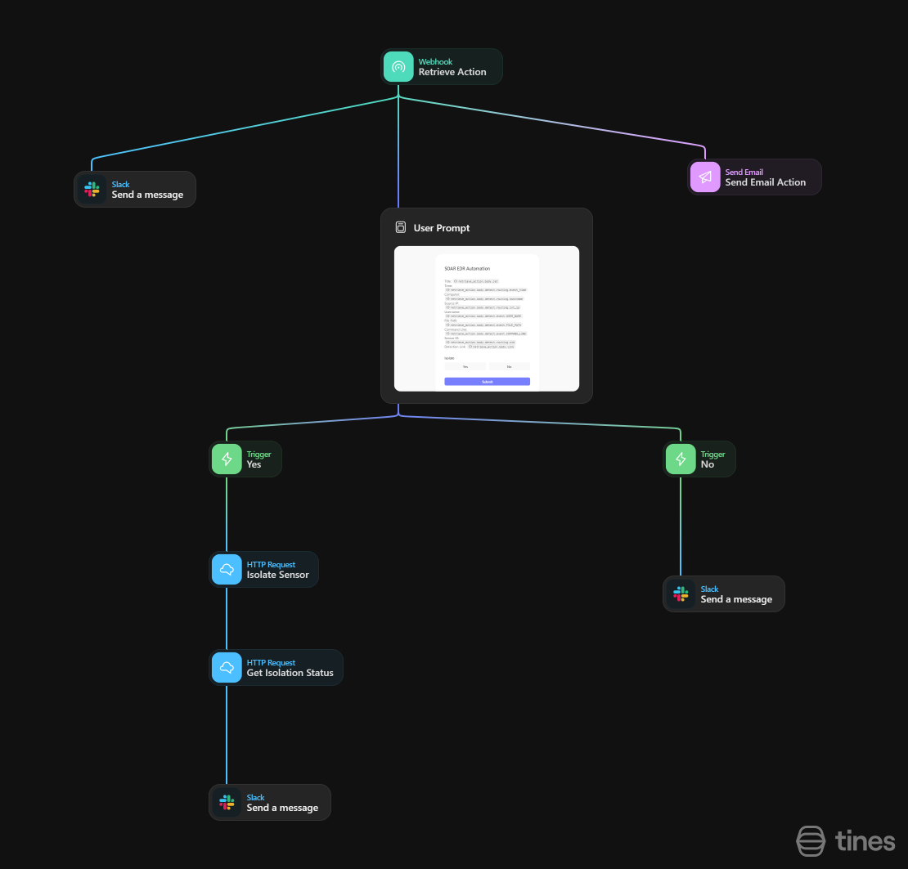
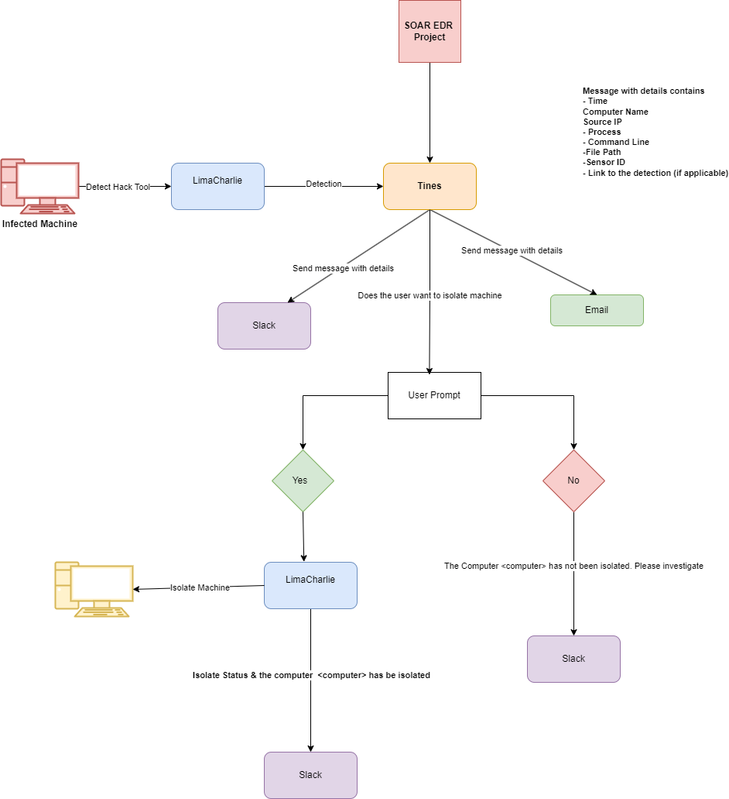

# SOAR EDR Project Documentation 

## Introduction
The SOAR EDR Project is an integrated solution that combines Endpoint Detection and Response (EDR), Security Orchestration and Automation (SOAR), and communication platforms to streamline the detection, notification, and response to cybersecurity threats. The system uses **LimaCharlie** for endpoint detection and isolation, **Tines** for automation and orchestration, and Slack for real-time collaboration. This documentation outlines the technical components, workflows, and data structures used within the system. This project was inspired by [MyDFIR](https://www.mydfir.com/)

## System Components
#### 1. Endpoint Detection and Response (LimaCharlie)
  - Purpose: Monitor endpoints for suspicious activity and respond to threats.
  - **Features Used:**
    - **Detection**: Rules configured in LimaCharlie to identify malicious behaviors such as unauthorized command execution, anomalous file changes, or network traffic.
    - **Event Forwarding**: Sends structured detection alerts (JSON format) to Tines via a webhook.
    - **Isolation Capabilities:**
      - Enforce network-level isolation (e.g., blocking all traffic except management traffic).
      - Stop specific processes or quarantine files.
  - **Detection Alerts:**
   ```
   # Tines Configuration Webhook
   Title: <<retrieve_action.body.cat>>
   Time: <<retrieve_action.body.detect.routing.event_time>>
   Computer: <<retrieve_action.body.detect.routing.hostname>>
   Source IP: <<retrieve_action.body.detect.routing.int_ip>>
   Username: <<retrieve_action.body.detect.event.USER_NAME>>
   File Path: <<retrieve_action.body.detect.event.FILE_PATH>>
   Command Line: <<retrieve_action.body.detect.event.COMMAND_LINE>>
   Sensor ID: <<retrieve_action.body.detect.routing.sid>>
   Detection Link:<<retrieve_action.body.link>>
   ```
#### 2. Security Orchestration and Automation (Tines)
  - **Purpose:** Automate security workflows of detection alerts and orchestrate responses to threats.
  - **Features Used:**
    - **Workflow Builder:** Automates actions based on events from LimaCharlie.
    - **Decision Points:** Implements logical conditions for user prompts and branching workflows.
    - **Outgoing Connectors:**
      - Slack API for notifications.
      - Email services for detailed threat reports.
    - **Inbound Connectors:**
      - Webhook from LimaCharlie for detection alerts.
  - **Workflow Logic:**
      1. Receive a detection event from LimaCharlie.
      2. Parse the event and extract key fields (e.g., computer name, username, file path, command line, etc.)
      3. Send structured notifications to Slack and email.
      4. Prompt the user via a webpage to decide on isolation.
      5. Based on the user's response:
            - Call LimaCharlie API to isolate the endpoint.
            - Send status updates to Slack and email.
  - **Tines Workflow:**
  
#### 3. Communication Platform (Slack)
  - **Purpose:** Central platform for Real-time collaboration and notification.
  - **Features Used:**
    - Receive automated alerts and status updates from Tines.
    - Interactive components allow users to approve or reject isolation actions.
  - **Slack Message Format:**
  ```
  # Slack (Tines) Configuration Webhook
  Title: <<retrieve_action.body.cat>>
  Time: <<retrieve_action.body.detect.routing.event_time>>
  Computer: <<retrieve_action.body.detect.routing.hostname>>
  Source IP: <<retrieve_action.body.detect.routing.int_ip>>
  Username: <<retrieve_action.body.detect.event.USER_NAME>>
  File Path: <<retrieve_action.body.detect.event.FILE_PATH>>
  Command Line: <<retrieve_action.body.detect.event.COMMAND_LINE>>
  Sensor ID: <<retrieve_action.body.detect.routing.sid>>
  Detection Link: <<retrieve_action.body.link>>
  ```   
## Technical Workflow

### Step-by-Step Process
  - **Detection Event:**
    - An infected machine triggers a detection event due to abnormal activity defined in the detection rules.
    - This event is forwarded to Tines via API in JSON format.
  - **Tines Processing:**
    - Tines parses the alerts and structures them into actionable information.
    - It sends notifications to Slack and email channels with threat details.
  - **Slack Notification:**
    - A Slack message with the detection details and action buttons is sent to the relevant security team channel.
    - The team member decides to isolate the machine by clicking a button.
  - **User Decision:**
    - If the user selects "Isolate Machine":
        - Tines calls the LimaCharlie API to enforce network-level isolation.
        - A confirmation message from Slack indicates the machine has been isolated.
    - If the user selects "Do Not Isolate":
        - A message is sent to Slack, logging that the machine was not isolated and recommending further investigation.
  - **Post-Isolation Notification:**
     - Slack receives updates on the machine's isolation status.
     - The detection incident is logged for audit and reporting purposes.
#### Dataflow Architecture
  1. **Detection Source:** LimaCharlie generates threat alerts.
  2. **Event Processing:** Tines ingest the alerts, enrich the data, and trigger notifications.
  3. **Communication Channels:**
    - Slack: Primary real-time interface for alerts and response.
    - Email: Backup for non-real-time notification.
  4. **Response Actions:**
    - User decision (Webpage)
    - Automated endpoint isolation(via Tines).
#### Error Handling
  1. **Failed Isolation:**
    - Tines retries the isolation request up to 3 times.
    - If the API calls fail, an error notification is sent to Slack for manual intervention.
  2. **Slack API Failures:**
    - Notifications fall back to email if Slack API calls fail.
  3. **Email Delivery Failures:**
    - Retry mechanism with exponential backoff ensures delivery.
#### Merits
  - **Automation:** Reduces manual intervention in routine tasks like detection notifications and endpoint isolation.
  - **Flexibility:** Allows manual decisions for potential false positives.
  - **Centralized Visibility:** Slack serves as a single pane of glass for threat response actions and updates.
  - **Scalability:** Designed to handle multiple simultaneous detection events.
