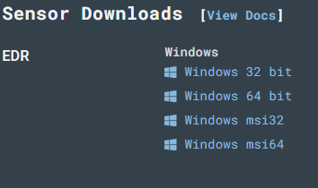

## Windows Configuration
1. Download the Windows Server 2022 from [Microsoft](https://www.microsoft.com/en-us/evalcenter/evaluate-windows-server-2022).
2. Install it on Virtualbox or VMware
3. Create a LimaCharlie account
   1. Download the LimaCharlie Sensor onto machine
        
   2. Install the LimaCharlie with the following command
        ```
        .\hcp_win_x64_release_4.29.0.exe -i <Installation Key>
        ```
4. The Lazagne will act as a malicious application 
   1. Download [Lazagne](https://github.com/AlessandroZ/LaZagne)
   2. Install lazagne with the following cmd:
    ```
        .\LaZagne.exe
    ```